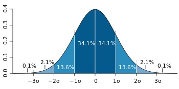

# Data Science

## Removing Outliers using Standard deviation & Normal Distribution

**Standard Deviation** is one of the most underrated statistical tools out there. It’s an extremely useful metric that most people know how to calculate but very few know how to use effectively.

## What is Standard Deviation ?
Standard deviation is a metric of variance i.e. how much the individual data points are spread out from the mean.

For example, consider the two data sets:

* 27 23 25 22 23 20 20 25 29 29
 
and

* 12 31 31 16 28 47 9 5 40 47
 
Both have the same mean 25. However, the first dataset has values closer to the mean and the second dataset has values more spread out.

To be more precise, the standard deviation for the first dataset is 3.13 and for the second set is 14.67.

However, it's not easy to wrap your head around numbers like 3.13 or 14.67. Right now, we only know that the second data set is more “spread out” than the first one.

Let’s put this to a more practical use.

## What is normal distribution?
 
When we perform analytics, we often come across data that follow a pattern with values rallying around a mean and having almost equal results below and above it e.g.

* height of people,
* blood pressure values
* test marks

Such values follow a normal distribution.

According to the [Mathsisfun](https://www.mathsisfun.com/data/standard-normal-distribution.html) article on normal distribution, about 68% of values drawn from a normal distribution are within one standard deviation σ away from the mean; about 95% of the values lie within two standard deviations; and about 99.7% are within three standard deviations.

This fact is known as the 68-95-99.7 (empirical) rule, or the 3-sigma rule.

For more information on normal distribution you can refer to https://www.mathsisfun.com/data/standard-normal-distribution.html

## Approach for Removal of Outliers Using Normal Distribution and S.D.

Our approach was to remove the outlier points by eliminating any points that were above (Mean + 2*SD) and any points below (Mean - 2*SD) before plotting the frequencies.

You don’t have to use 2 though, you can tweak it a little to get a better outlier detection formula for your data.

Here’s an example using Python programming. The dataset is a classic normal distribution but as you can see, there are some values like 10, 20 which will disturb our analysis and ruin the scales on our graphs.

